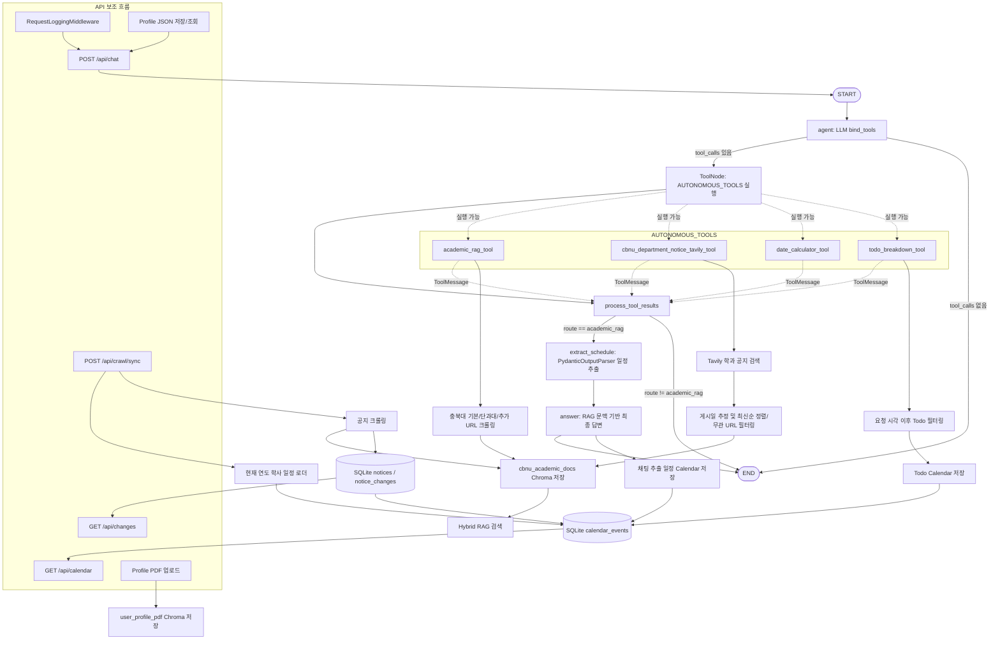

# CBNU Academic Planner Agent

충북대학교 학사 일정, 공지, 개인 프로필을 바탕으로 학생에게 필요한 일정과 할 일을 정리해주는 FastAPI + LangGraph 기반 학사 플래너 Agent입니다.

사용자는 웹 채팅창에 자연어로 질문하고, Agent는 `bind_tools`로 연결된 Tool 중 필요한 도구를 자율적으로 선택해 실행합니다. Calendar UI에는 학사 일정, 공지 변경 감지 결과, 채팅에서 추출된 일정, Todo 일정이 함께 표시됩니다.

## 문제 정의

충북대학교 학생들은 학사 일정, 공지사항, 제출 기한, 수강 관련 정보 등을 확인하기 위해 여러 웹페이지를 직접 방문해야 합니다. 또한 일부 정보만 알림으로 제공되기 때문에, 학생이 모든 중요 일정을 지속적으로 확인하지 않으면 필요한 정보를 놓칠 가능성이 있습니다. 특히 장학금 신청, 학부 연계 대회, 수강 신청, 서류 제출과 같은 일정은 마감일을 놓칠 경우 학업적 기회 상실이나 행정적 불이익으로 이어질 수 있습니다.

따라서 본 프로그램은 분산된 학사 정보를 자동으로 수집하고, 공지 변경 사항을 감지하며, 사용자 프로필에 따라 필요한 일정과 할 일을 정리해주는 개인화 학사 일정 관리 Agent를 구현하고자 합니다.

## 주요 기능

- FastAPI 기반 Web Chat UI
- LangGraph `StateGraph` 기반 Agent 실행 흐름
- LLM `bind_tools` 기반 자율 Tool 선택 및 `ToolNode` 실행
- 충북대학교 공식/단과대학/추가 URL 실시간 크롤링
- Tavily 기반 학과별 공지사항 검색 및 최신순 정렬
- Persistent Chroma + Runtime 문서 기반 Hybrid RAG
- 현재 연도 1월 1일부터 12월 31일까지 Calendar 표시
- Calendar 날짜 클릭 시 해당 날짜의 일정/Todo 상세 확인
- 공지 신규/변경 감지 결과 SQLite 저장
- 학사 일정/공지/채팅 추출 일정 Calendar 저장
- 채팅 기반 Todo 자동 분해 및 Calendar 반영
- 요청 시각 기준 이후 날짜의 Todo만 생성/표시
- 직접 입력형 사용자 Profile 설정
- Profile을 Agent 검색/답변/Todo 생성에 반영
- LangGraph `InMemorySaver` 기반 멀티턴 대화
- Request Logging Middleware 적용

## 사용 예시

```text
이번 달 충북대 학사일정 중 중요한 것만 정리해줘
수강신청 관련 공지 찾아줘
장학금 신청 마감일이 있는지 알려줘
2026-08-05까지 며칠 남았어?
장학금 신청 준비를 할 일로 나눠줘
내 학과 기준으로 중요한 공지만 알려줘
컴퓨터공학과 공지사항 최신 것부터 알려줘
소프트웨어학부 장학 공지 찾아줘
```

## 실행 흐름



서버 실행 후 LangGraph 다이어그램은 다음 주소에서도 확인할 수 있습니다.

```text
http://127.0.0.1:8000/api/graph/mermaid
```

## 설치

### 1. 가상환경 생성

```bash
python -m venv .venv
```

Windows PowerShell:

```bash
.venv\Scripts\activate
```

macOS/Linux:

```bash
source .venv/bin/activate
```

### 2. 패키지 설치

```bash
pip install -r requirements.txt
```

주요 패키지는 다음 계열을 사용합니다.

- `langchain>=1.0.0`
- `langgraph>=1.0.0`
- `langchain-openai>=1.0.0`
- `langchain-chroma>=0.2.0`
- `fastapi>=0.115.0`
- `chromadb>=0.5.0`

### 3. 환경변수 설정

`.env.example`을 복사해 `.env`를 만듭니다.

```bash
copy .env.example .env
```

macOS/Linux:

```bash
cp .env.example .env
```

`.env` 예시:

```env
OPENAI_API_KEY=your_openai_api_key_here
TAVILY_API_KEY=tvly-your-api-key
OPENAI_MODEL=gpt-4o-mini
OPENAI_EMBEDDING_MODEL=text-embedding-3-small
CBNU_DEPARTMENT_NOTICE_DOMAINS=cbnu.ac.kr,chungbuk.ac.kr,software.cbnu.ac.kr,computer.chungbuk.ac.kr
CBNU_EXTRA_SOURCES=https://department1.example.edu,https://department2.example.edu
```

`CBNU_EXTRA_SOURCES`는 선택값입니다. 기본 충북대학교 공식/단과대학 URL 외에 특정 학과 홈페이지를 더 크롤링하고 싶을 때 쉼표로 구분해 추가합니다.

`TAVILY_API_KEY`는 학과별 공지사항 검색 Tool에서 사용합니다. `CBNU_DEPARTMENT_NOTICE_DOMAINS`는 Tavily 검색을 제한할 도메인 목록이며, 쉼표로 여러 도메인을 지정할 수 있습니다. 도메인 제한 검색에서 결과가 부족하면 Tool이 한 번 더 넓게 검색한 뒤 충북대학교/학과 공지로 보이는 URL만 필터링합니다.

### 4. 서버 실행

```bash
uvicorn app.main:app --reload
```

브라우저 접속:

```text
http://127.0.0.1:8000
```

## Web UI

### Profile

직접 입력 방식으로 개인화를 설정합니다.

입력 항목:

- 이름
- 단과대학
- 학과
- 학년
- 학적/구분
- 관심 항목
- 추가 메모

저장된 Profile은 브라우저 `session_id` 기준으로 `data/profiles.json`에 저장됩니다. 이후 채팅 요청 시 Agent의 `request_metadata.profile`에 포함되어 검색어 보강, 답변 우선순위, Todo 생성에 반영됩니다.

### Chat

사용자 자연어 요청을 받아 LangGraph Agent를 실행합니다. Agent는 `bind_tools`로 연결된 도구 중 필요한 것을 직접 선택하고, `ToolNode`가 실제 도구를 실행합니다.

### Todo

별도 Todo 입력칸은 없습니다. 채팅창에서 Todo 생성을 요청하면 Agent가 `todo_breakdown_tool`을 실행합니다.

Todo는 요청 시각의 날짜를 기준으로 이후 날짜만 표시/저장됩니다. 관련 학사 일정이 Calendar DB에 있어야 날짜 지정 품질이 좋아집니다.

### Calendar

서버 실행 시점의 현재 연도를 기준으로 `YYYY-01-01`부터 `YYYY-12-31`까지의 일정을 표시합니다.

Calendar에는 다음 항목이 표시됩니다.

- 학사 일정 동기화 결과
- 공지 변경 감지에서 추출된 일정
- 채팅에서 추출된 일정
- Todo 자동 분해 결과

Calendar의 날짜 칸을 클릭하면 해당 날짜에 저장된 일정과 Todo가 상세 패널에 분리되어 표시됩니다.

## API

### Health

```http
GET /api/health
```

### Chat

```http
POST /api/chat
```

요청:

```json
{
  "message": "장학금 신청 준비를 할 일로 나눠줘",
  "session_id": "browser-session-id"
}
```

응답에는 `answer`, `route`, `sources`, `schedules`, `todos`, `calendar_events`가 포함됩니다.

### Profile 저장

```http
POST /api/profile
```

요청:

```json
{
  "session_id": "browser-session-id",
  "name": "홍길동",
  "college": "전자정보대학",
  "department": "소프트웨어학부",
  "grade": "3학년",
  "student_type": "재학생",
  "interests": ["수강", "장학", "졸업"],
  "memo": "졸업 요건과 장학 공지를 우선 확인"
}
```

### Profile 조회

```http
GET /api/profile/{session_id}
```

### 공지/학사일정 동기화

```http
POST /api/crawl/sync
```

동작:

1. 충북대학교 학사 일정 페이지에서 현재 연도 전체 일정을 수집
2. 기본/단과대학/추가 URL을 크롤링
3. 문서를 Chroma에 저장
4. URL별 content hash를 SQLite에 저장
5. 신규/변경 공지를 감지
6. 일정 후보를 Calendar DB에 저장

### Calendar

```http
GET /api/calendar
```

현재 연도 범위의 Calendar 이벤트를 반환합니다.

### 변경 감지 이력

```http
GET /api/changes
```

SQLite에 기록된 신규/변경 공지 이력을 반환합니다.

### Todo 자동 분해

```http
POST /api/todos/breakdown
```

보조 API입니다. Web UI에서는 입력을 통해 `/api/chat`을 통해 Todo를 생성합니다.

### Mermaid Graph

```http
GET /api/graph/mermaid
```

LangGraph 실행 흐름을 Mermaid 텍스트로 반환합니다.

## LangGraph Agent

Agent 상태는 `app/agent/graph.py`의 `AgentState`로 관리합니다.

주요 상태:

- `messages`
- `query`
- `rewritten_query`
- `route`
- `raw_docs`
- `context_docs`
- `schedules`
- `todos`
- `answer`
- `request_metadata`

노드:

- `agent`: LLM이 `bind_tools`로 연결된 Tool 중 필요한 Tool을 선택
- `tools`: LangGraph `ToolNode`가 `AIMessage.tool_calls`를 실제 실행
- `process_tool_results`: Tool 실행 결과를 `context_docs`, `todos`, `answer` 상태로 변환
- `extract_schedule`: RAG 문맥에서 일정 JSON 추출
- `answer`: RAG 문맥과 일정 JSON을 바탕으로 최종 답변 생성

조건부 분기:

- `agent` 결과에 `tool_calls`가 있으면 `tools`로 이동
- `tool_calls`가 없으면 바로 종료하며 직접 응답 또는 가드레일 응답 사용
- Tool 결과가 `academic_rag_tool` 또는 `cbnu_department_notice_tavily_tool`이면 일정 추출과 최종 답변 생성으로 이동
- Tool 결과가 날짜 계산 또는 Todo이면 후처리 후 종료

Memory:

- `InMemorySaver` checkpointer 사용
- Web UI는 `localStorage`에 `cbnu_session_id`를 저장
- 같은 `thread_id`로 멀티턴 대화 유지

## Tools

### `academic_rag_tool`

충북대학교 학사/공지 질문에 대해 실시간 크롤링, Chroma 저장, Hybrid RAG 검색을 한 번에 수행합니다. Agent가 학사 질문이라고 판단하면 우선 선택하는 도구입니다.

### `cbnu_department_notice_tavily_tool`

Tavily Search API로 충북대학교 특정 학과 공지사항을 검색하고, 검색 결과를 Chroma에 저장합니다. 사용자가 학과명을 직접 말하거나 Profile에 학과가 설정되어 있으면 Agent가 `department_name`을 채워 호출합니다.

현재 구현은 다음 처리를 포함합니다.

- `department_name`, `query`, `max_results`를 받아 학과 공지 검색어 생성
- Tavily 결과에서 게시일을 추정해 최신순 정렬
- 통합검색 페이지, 첨부파일 다운로드 URL, 외부 대학/무관 URL 필터링
- `published_date`와 출처 URL을 답변 문맥에 포함
- 검색 결과를 `cbnu_academic_docs` Chroma collection에 저장

### `date_calculator_tool`

`YYYY-MM-DD` 또는 `YYYY.MM.DD` 형식 날짜까지 남은 기간을 계산합니다.

### `todo_breakdown_tool`

학사 목표를 실행 가능한 Todo 목록으로 분해합니다. `reference_date`를 받아 요청일 이후의 일정으로 조정합니다.

## RAG 구성

RAG 파이프라인은 `app/services/rag.py`, `app/services/vector_db.py`, `app/agent/tools.py`에 걸쳐 구성됩니다.

1. 크롤러 또는 Tavily 학과 공지 Tool이 충북대학교 관련 문서를 수집
2. `Document`로 변환
3. `cbnu_academic_docs` Chroma collection에 저장
4. 요청 시점의 Runtime 문서와 Persistent Chroma 문서를 함께 검색
5. 검색 결과를 `answer_node`의 LLM 프롬프트에 제공

Chroma 저장 경로:

```text
data/chroma/
├── cbnu_academic_docs/
```

## SQLite 저장소

SQLite 경로:

```text
data/cbnu_agent.db
```

주요 테이블:

- `notices`: URL별 최신 content hash
- `notice_changes`: 신규/변경 감지 이력
- `calendar_events`: Calendar UI에 표시할 일정

## Middleware

`RequestLoggingMiddleware`가 적용되어 있습니다.

기능:

- 요청 ID 생성
- 요청 시각 `requested_at` 기록
- HTTP method/path 로깅
- 상태 코드와 처리 시간 로깅
- `/api/chat` 요청에 Agent용 메타데이터 부착

Todo 생성은 이 `requested_at`을 기준으로 현재 이후 일정만 유지합니다.

## OutputParser

`PydanticOutputParser`를 사용해 검색 문맥에서 학사 일정 JSON을 추출합니다.

```python
class AcademicSchedule(BaseModel):
    title: str
    category: Literal["학사", "수강", "장학", "졸업", "등록", "시험", "휴복학", "기타"]
    start_date: Optional[str]
    end_date: Optional[str]
    deadline: Optional[str]
    importance: Literal["high", "medium", "low"]
    source_url: Optional[str]
    evidence: str
```

## 프로젝트 구조

```text
cbnu_academic_agent/
├── app/
│   ├── agent/
│   │   ├── graph.py
│   │   └── tools.py
│   ├── middleware/
│   │   └── logging.py
│   ├── services/
│   │   ├── academic_schedule.py
│   │   ├── change_store.py
│   │   ├── crawler.py
│   │   ├── date_utils.py
│   │   ├── profile_store.py
│   │   ├── rag.py
│   │   ├── todo.py
│   │   └── vector_db.py
│   ├── static/
│   │   ├── index.html
│   │   ├── main.js
│   │   └── style.css
│   ├── config.py
│   ├── main.py
│   └── schemas.py
├── data/
│   ├── cbnu_agent.db
│   ├── chroma/
│   └── profiles.json
├── scripts/
│   └── export_graph.py
├── requirements.txt
├── .env.example
├── workflow.mmd
└── README.md
```

## 구현 체크리스트

- FastAPI + LangGraph Agent 유지
- 사용자 Profile 직접 설정 기능 추가
- Profile을 Agent 요청 메타데이터에 반영
- PDF 업로드 후 Chroma 저장 보조 기능 유지
- 학사 일정/공지 크롤링 후 Chroma 저장
- Tavily 기반 학과별 공지사항 검색 Tool 추가
- 학과 공지 검색 결과 최신순 정렬 및 무관 결과 필터링
- Calendar UI 추가
- Calendar 날짜 클릭 상세 패널 추가
- 공지 변경 감지용 SQLite 추가
- 변경 감지 결과 Calendar 반영
- Todo 자동 분해 Tool 추가
- Todo를 채팅 기반으로 생성
- 요청 시각 이후 Todo만 Calendar에 표시
- README 및 Workflow 문서 최신화

## 한계 및 개선 방향

### 한계
- Chroma/SQLite/프로필 JSON은 로컬 파일 기반입니다. 운영 환경에서는 사용자 인증, 백업, 동시성 전략이 필요합니다.
- `InMemorySaver` 기반 대화 이력은 프로세스 재시작 시 사라집니다.
- 학교 홈페이지 HTML 구조가 바뀌면 크롤링 품질이 달라질 수 있습니다.
- HWP 등 첨부파일 파싱은 현재 범위에 포함하지 않았습니다.

### 개선 방향
- 향후 Google Calendar 연동, 사용자별 로그인, Profile DB 저장, 일정 수정/삭제 UI를 추가함으로써 Calendar 관련 기능까지 포함하여 개인 별 학부 일정 관리를 Agent를 통해 단순화 할 수 있습니다.
- 현재의 홈페이지 구조가 변경되거나 네트워크 오류가 발생할 경우 크롤링 결과가 불안정해질 수 있습니다. 이를 보완하기 위해서 크롤링 실패 시 재시도 로직, 중복 공지 제거, 변경 감지 로직, 크롤링 로그 저장 등의 추가 기능을 넣어 데이터 수집의 안정성을 높일 필요가 있습니다.
- 현재 Middleware는 요청 로깅을 중심으로 동작합니다. 향후에는 입력 검증, 예외 처리, rate limiting, 사용자 요청 필터링, 비정상 요청 차단 등의 기능을 추가하여 실제 서비스 환경에서도 안정적으로 동작하도록 개선할 예정입니다.

## 참고

- LangChain / LangGraph
- FastAPI
- Chroma
- 충북대학교 공식 홈페이지 및 학사일정/공지 페이지
