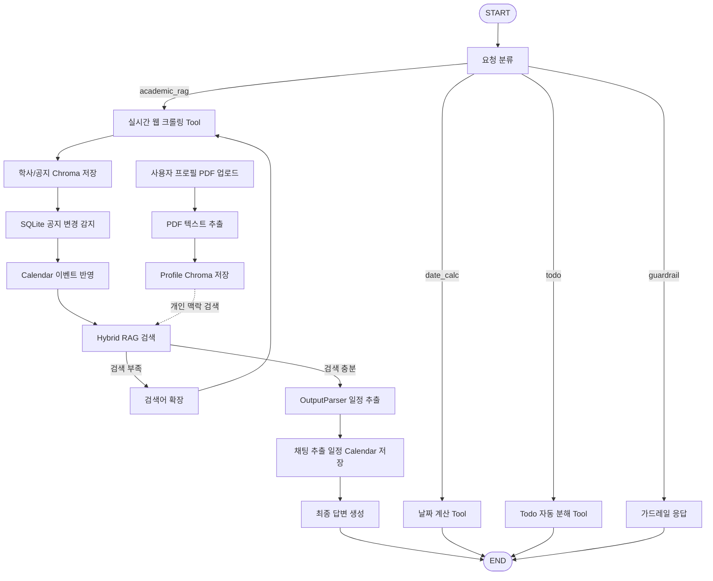

# CBNU Academic Planner Agent

충북대학교 학사 일정과 공지를 실시간으로 크롤링하고, RAG 검색 결과를 바탕으로 학생에게 필요한 일정을 정리해주는 LangGraph 기반 Agent 서비스입니다.

## 1. 서비스 소개

이 서비스는 사용자의 자연어 질문을 받아 다음 작업을 수행합니다.

- 충북대학교 공식 홈페이지/학사일정/공지사항 페이지 실시간 크롤링
- 크롤링 문서 기반 Runtime RAG 검색 + 영구 Chroma 검색
- 사용자 프로필 PDF 업로드 후 Chroma 저장
- 학사 일정/공지 크롤링 결과를 Chroma에 저장
- 공지 신규/변경 감지를 SQLite에 기록
- 변경 감지 결과와 채팅에서 추출한 일정을 Calendar UI에 반영
- 학사 목표를 실행 가능한 Todo로 자동 분해
- 공지 본문에서 일정, 신청 기간, 마감일 추출
- 이전 대화 맥락을 유지한 멀티턴 응답
- FastAPI 기반 Web Chat UI 제공

## 2. 사용 시나리오

예시 질문:

```text
이번 달 충북대 학사일정 중 중요한 것만 정리해줘
수강신청 관련 공지 찾아줘
장학금 신청 마감일이 있는지 알려줘
2026-08-05까지 며칠 남았어?
지난번에 말한 수강신청 일정 다시 정리해줘
```

## 3. 전체 아키텍처



LangGraph 코드에서 직접 다이어그램을 생성할 수도 있습니다.

```bash
python scripts/export_graph.py
```

또는 서버 실행 후 다음 주소에서 확인할 수 있습니다.

```text
http://127.0.0.1:8000/api/graph/mermaid
```

## 4. 설치 및 실행 방법

### 4.1. 가상환경 생성

```bash
python -m venv .venv
```

Windows PowerShell:

```bash
.venv\Scripts\activate
```

macOS/Linux:

```bash
source .venv/bin/activate
```

### 4.2. 패키지 설치

```bash
pip install -r requirements.txt
```

### 4.3. 환경변수 설정

`.env.example`을 복사해 `.env`를 만듭니다.

```bash
copy .env.example .env
```

macOS/Linux:

```bash
cp .env.example .env
```

`.env`에 OpenAI API Key를 입력합니다.

```env
OPENAI_API_KEY=your_openai_api_key_here
OPENAI_MODEL=gpt-4o-mini
OPENAI_EMBEDDING_MODEL=text-embedding-3-small
CBNU_EXTRA_SOURCES=https://department1.example.edu,https://department2.example.edu
```

`CBNU_EXTRA_SOURCES`는 선택값입니다. 기본 충북대학교 공식/단과대학 소스 외에 특정 학과 독립 홈페이지를 더 크롤링하고 싶을 때 쉼표로 구분해 추가합니다.

### 4.4. 서버 실행

```bash
uvicorn app.main:app --reload
```

브라우저에서 접속합니다.

```text
http://127.0.0.1:8000
```

## 5. 사용된 Tool

### `realtime_cbnu_crawl_tool`

충북대학교 공식 페이지와 관련 링크를 실시간으로 크롤링합니다.

### `runtime_rag_search_tool`

영구 Chroma DB와 요청 시점의 임시 VectorStore를 함께 검색합니다.

### `date_calculator_tool`

사용자가 입력한 날짜까지 남은 기간을 계산합니다.

### `todo_breakdown_tool`

학사 일정, 신청 업무, 준비 목표를 실행 가능한 Todo 목록으로 분해합니다.

## 6. RAG 구성

1. 충북대학교 공식 URL 실시간 크롤링
2. BeautifulSoup 기반 본문 텍스트 추출
3. 크롤링 문서를 `cbnu_academic_docs` Chroma collection에 저장
4. 사용자 프로필 PDF를 `user_profile_pdf` Chroma collection에 저장
5. Runtime VectorStore와 Persistent Chroma를 함께 검색
6. 유사도 검색 결과를 LLM 답변에 반영

저장 경로:

```text
data/chroma/
├── cbnu_academic_docs/
└── user_profile_pdf/
```

## 7. API

### Chat

```http
POST /api/chat
```

LangGraph Agent를 실행합니다. 응답의 `schedules`는 Calendar에 저장됩니다.

### 사용자 프로필 PDF 업로드

```http
POST /api/profile/upload
```

`multipart/form-data`의 `file` 필드로 PDF를 업로드합니다. PDF 텍스트를 추출해 Chroma에 저장합니다.

### 공지/학사일정 동기화

```http
POST /api/crawl/sync
```

충북대학교 학사/공지 페이지를 크롤링하고 Chroma에 저장합니다. URL별 content hash를 SQLite에 저장해 신규/변경/동일을 감지합니다.

### Calendar

```http
GET /api/calendar
```

채팅에서 추출된 일정과 공지 변경 감지에서 생성된 일정을 반환합니다.

### 변경 감지 이력

```http
GET /api/changes
```

SQLite에 기록된 공지 신규/변경 내역을 반환합니다.

### Todo 자동 분해

```http
POST /api/todos/breakdown
```

학사 목표나 일정을 실행 가능한 Todo 목록으로 분해합니다.

## 8. SQLite 변경 감지

SQLite 저장 경로:

```text
data/cbnu_agent.db
```

주요 테이블:

- `notices`: URL별 최신 content hash
- `notice_changes`: 신규/변경 감지 이력
- `calendar_events`: Calendar UI에 표시할 일정

## 9. Memory 구성

LangGraph `InMemorySaver` checkpointer와 `thread_id`를 사용합니다. FastAPI Web UI는 브라우저 localStorage에 `session_id`를 저장하고, 같은 세션의 대화 이력을 이어갑니다.

## 10. Middleware

`RequestLoggingMiddleware`를 적용했습니다.

기록 항목:

- 요청 ID
- HTTP method/path
- 상태 코드
- 처리 시간
- 예외 발생 여부

## 11. OutputParser

`PydanticOutputParser`를 사용해 검색 문맥에서 다음 구조의 일정 JSON을 추출합니다.

```python
class AcademicSchedule(BaseModel):
    title: str
    category: Literal["학사", "수강", "장학", "졸업", "등록", "시험", "휴복학", "기타"]
    start_date: Optional[str]
    end_date: Optional[str]
    deadline: Optional[str]
    importance: Literal["high", "medium", "low"]
    source_url: Optional[str]
    evidence: str
```

## 12. 프로젝트 구조

```text
cbnu_academic_agent/
├── app/
│   ├── agent/
│   │   ├── graph.py
│   │   └── tools.py
│   ├── middleware/
│   │   └── logging.py
│   ├── services/
│   │   ├── change_store.py
│   │   ├── crawler.py
│   │   ├── date_utils.py
│   │   ├── rag.py
│   │   ├── todo.py
│   │   └── vector_db.py
│   ├── static/
│   │   ├── index.html
│   │   ├── main.js
│   │   └── style.css
│   ├── config.py
│   ├── main.py
│   └── schemas.py
├── scripts/
│   └── export_graph.py
├── requirements.txt
├── .env.example
├── workflow.mmd
└── README.md
```

## 13. 구현 단계 체크리스트

- 1단계: 기존 FastAPI + LangGraph Agent 유지
- 2단계: 사용자 프로필 PDF 업로드 기능 추가
- 3단계: PDF -> Chroma 저장 구현
- 4단계: 학사 일정/공지 크롤링 -> Chroma 저장 구현
- 5단계: Calendar UI 추가
- 6단계: 공지 변경 감지용 SQLite 추가
- 7단계: 변경 감지 결과를 Calendar에 반영
- 8단계: Todo 자동 분해 Tool 추가
- 9단계: README와 Workflow 다이어그램 정리

## 14. 한계점 및 향후 개선 방향

- Chroma/SQLite는 로컬 파일 기반입니다. 운영 환경에서는 백업과 동시성 전략이 필요합니다.
- 학교 홈페이지의 HTML 구조가 변경되면 크롤링 품질이 달라질 수 있습니다.
- HWP 첨부파일 파싱은 MVP 범위에서 제외했습니다.
- 향후 Google Calendar 연동, 알림 기능, 사용자 관심 카테고리 저장 기능을 추가할 수 있습니다.

## 15. 참고 및 출처

- LangChain / LangGraph 공식 문서
- FastAPI 공식 문서
- 충북대학교 공식 홈페이지 및 공지/학사일정 페이지
